Key inputs in SAM and HOMER to compare them:

## SAM (Grid Outage):
- Create a _Detailed PV-Battery_, _Residential Owner_ case. 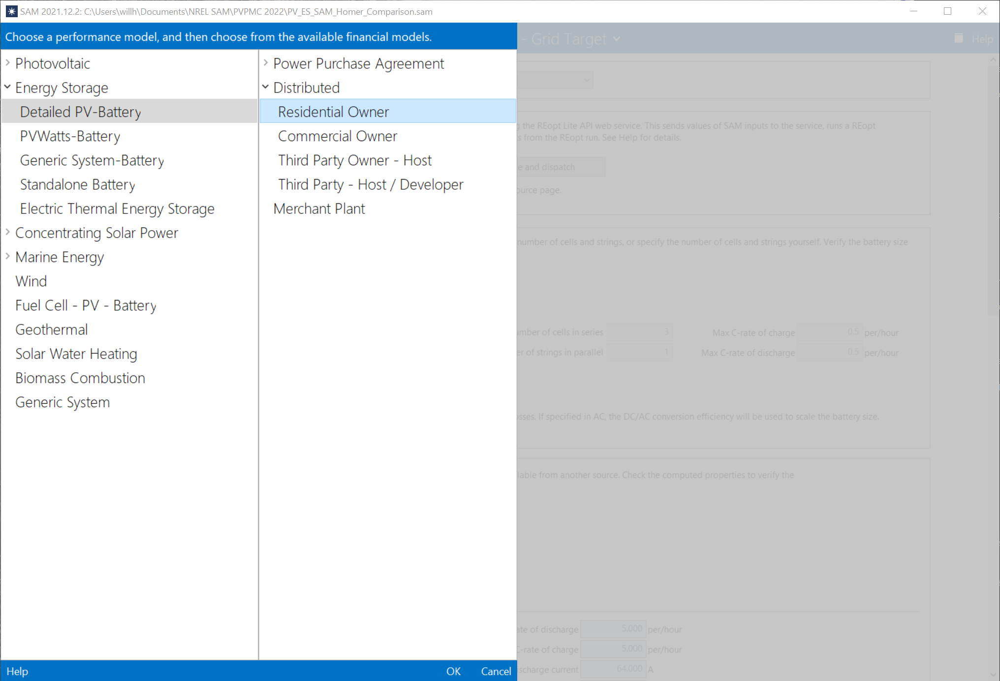
- Select a weather file
- Used the Simple Efficiency Module Model (defaults) and the Inverter Datasheet model (max power 100 W, DC voltages 1-40 Vdc, night power consumption 0 W) **[figure]** 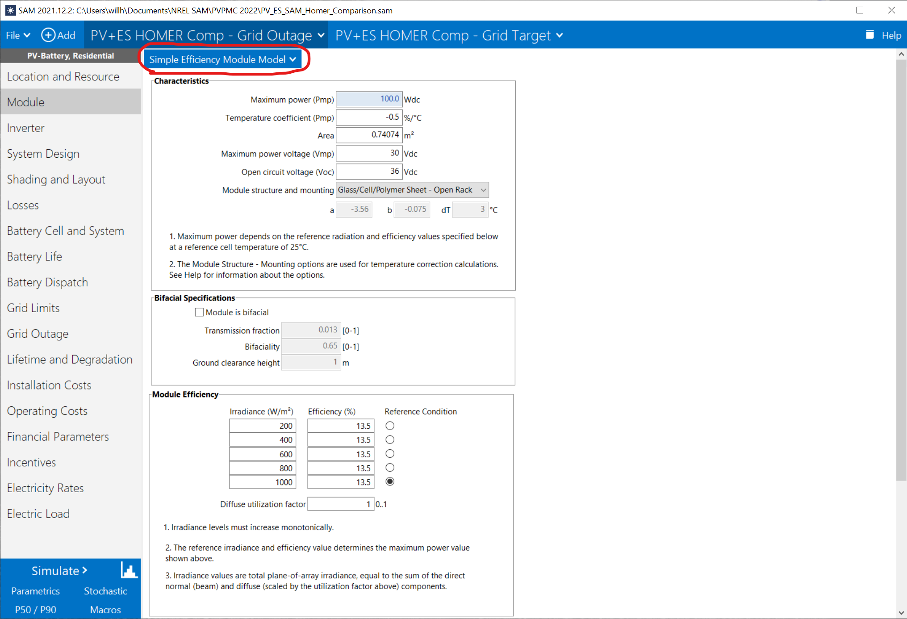
- System Design: enabled "Estimate Subarray 1 configuration", desired dc:ac ratio = 1. 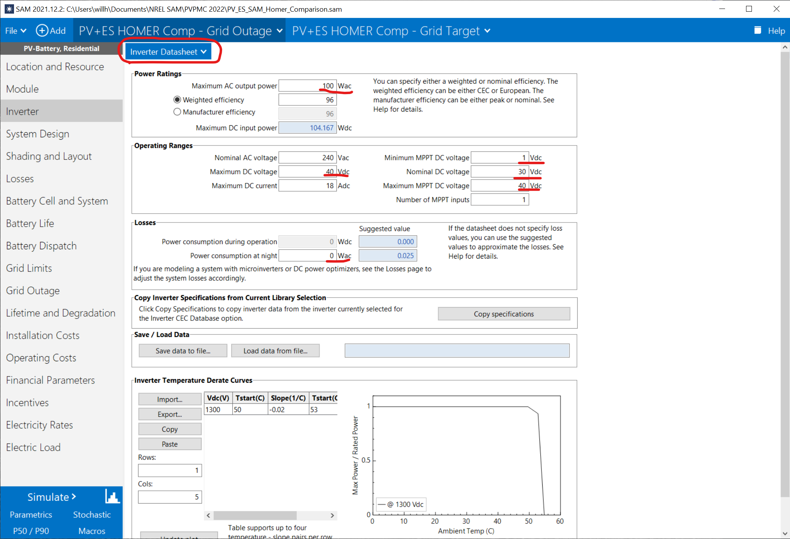
- Battery desired bank power = 30 kW (max PV array size to be tested). 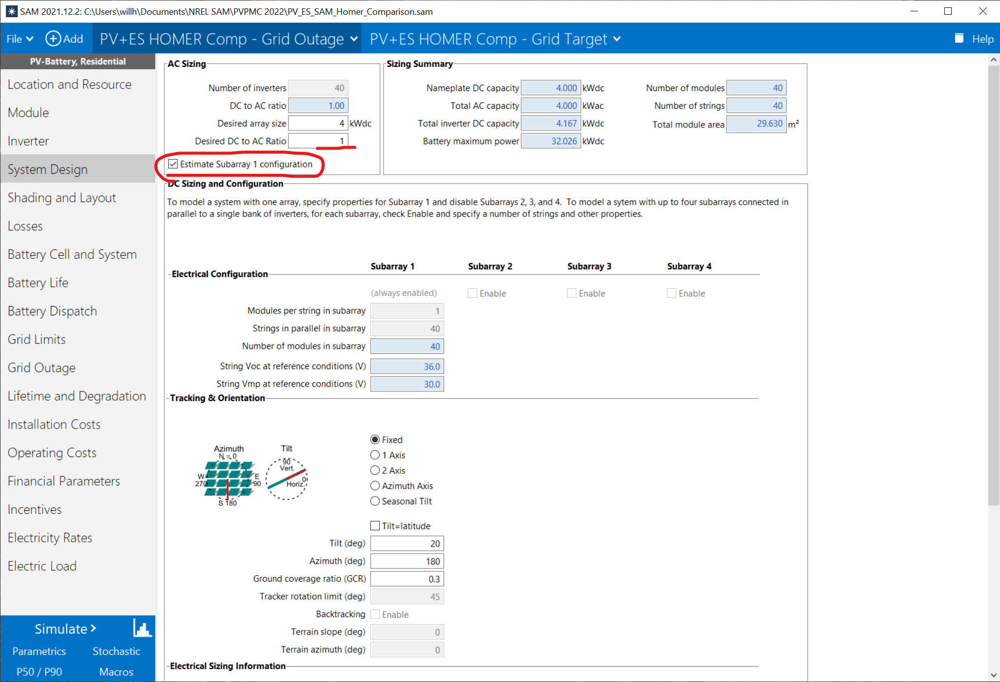
- Enable the Grid Outage option:
  - Set the _Critical load percent of electric load_ to 100%
  - Edit the grid outage time series to be 1 in every time step 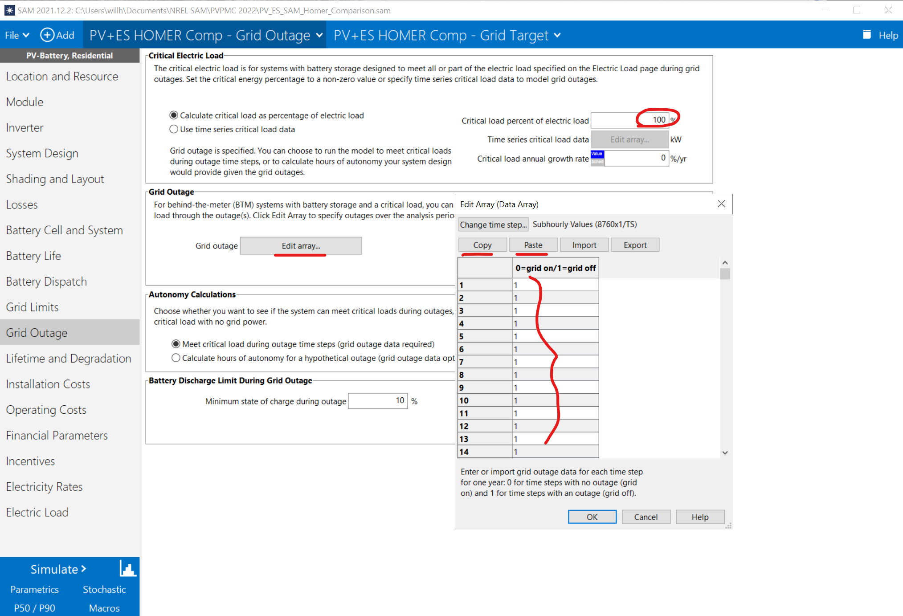
    - (**TIP: In the Edit Array window, select "Copy", then paste the array of "0" values into a spreadsheet. Chnage the first value to "1" and double-click the "fill handle" in the bottom right of the cell, or press Ctrl+Shift+↓ then Ctrl+D)** 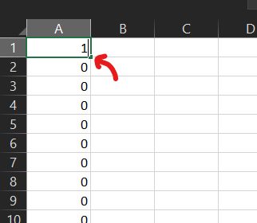
- Use the parametric tool to vary battery capacity (20, 40, 60, 80, 100 kWh) and PV size (5, 10, 15, 20, 25, 30 kWdc) and to output unmet critical load. 
  - To quickly setup the inputs to model all combinations, use the _Quick setup..._ option, add _Desired bank capacity (kWh)_ and _Desired array size (kW)_, and use the variable editor to define the range of values. 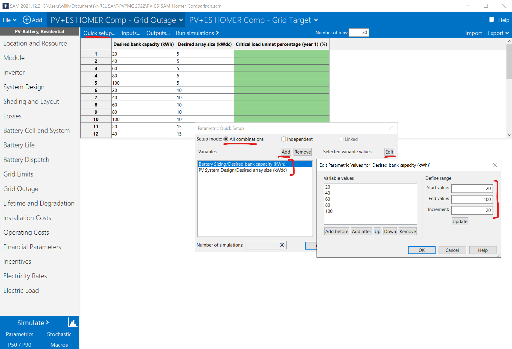
  - For the parametric output, use _Critical load unmet perentage (year 1) (%)_
- **TIP: for faster run times, set the Analysis period to 1 year in the Financial Parameters tab. Note that this ignores degradation, and many financial metrics will not be useful.**
- Exporting results: Use the Export > Save as CSV option in the parametric tool

## SAM (Grid Target)
Repeat the same steps as for the grid outage case, but instead of enabling the Grid Outage option, modify the battery dispatch an parametric outputs as described below. (**TIP: Duplicate the case if you modified a lot of inputs and want to save some time**).
- Under _Battery Dispatch_:
  - Set _Minimum state of charge_ to 10% (or whatever yo uset the _Battery Discharge Limit During Grid Outage_ to, if you modifed the default 10%)
  - Set the storage dispatch to _Input grid power targets_
  - Select _Edit values..._ for _Monthly grid power targets_ and set all months to "0" 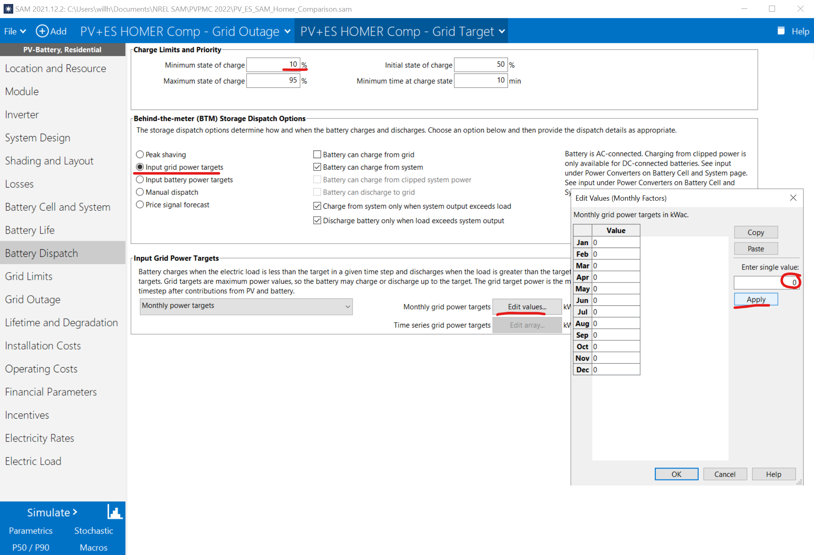
- Use parametric outputs _Electricity load total in each yeah (kWh)_ and _Annual energy imported from grid (kWh)_.
- After exporting parametric results, calculate unmet load in each year as the ratio of the two annual values.

## HOMER:
- Add a primary load, PV, Converter, and Battery 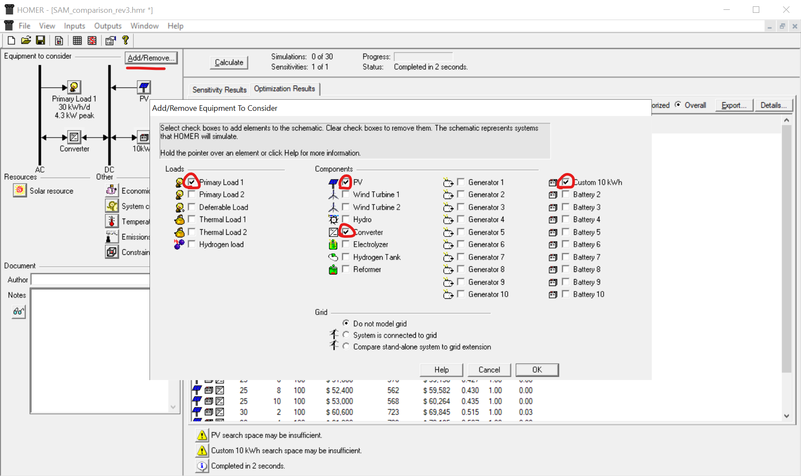
- Import solar resource (GHI), ambient temperature, and load datafiles
  - First copy/export these from SAM's weather file (GHI and temperature) and electric load.
  - Create separate text files for each variable, where values for each timestep are in a new row (no header or time stamps)
  - Save GHI and temperature files with .txt extension and load with .dmd 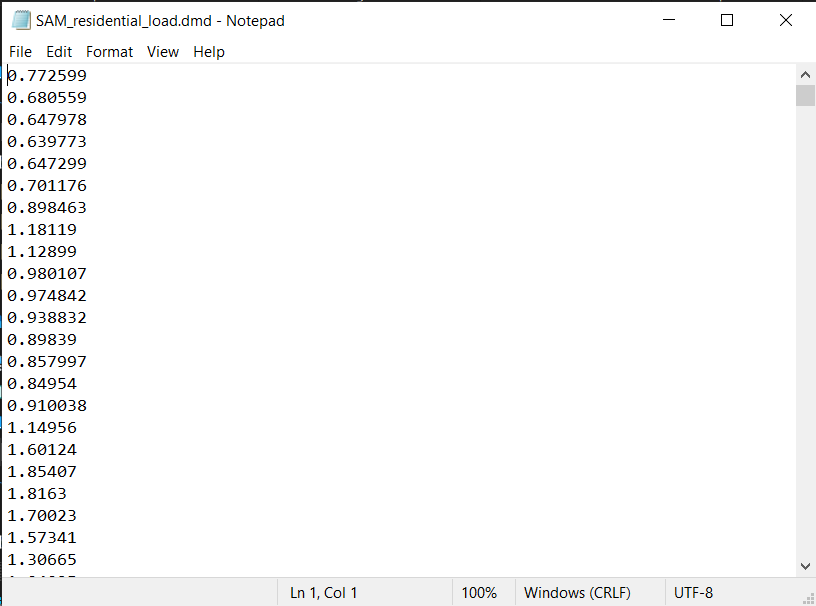 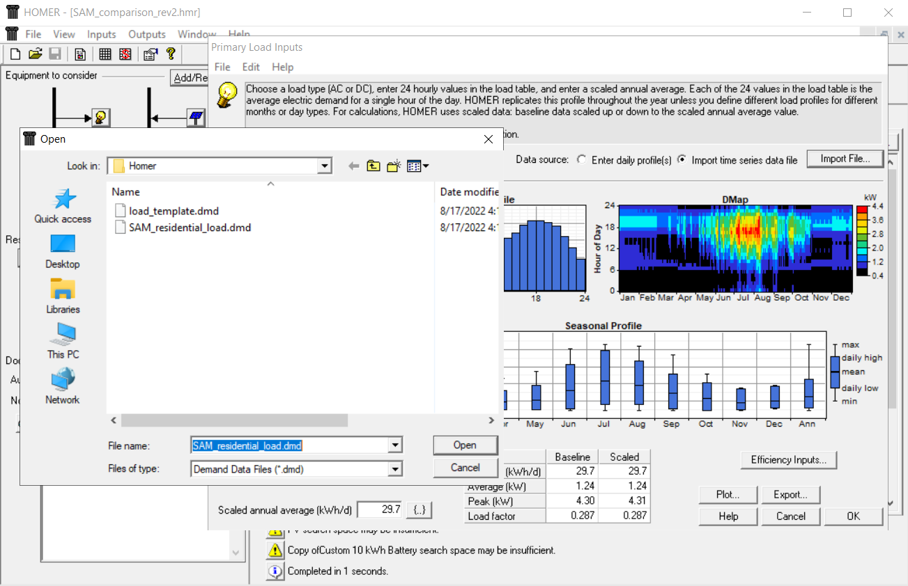 
- For PV: enable temperature effects, set slope to 20 deg (or whatever tilt you used in SAM) and derate factor to 90% (i.e., 10% losses, roughly what SAM's default losses are), considering the same range of PV sizes as SAM (5-30 kW). Cost data may be required as well. 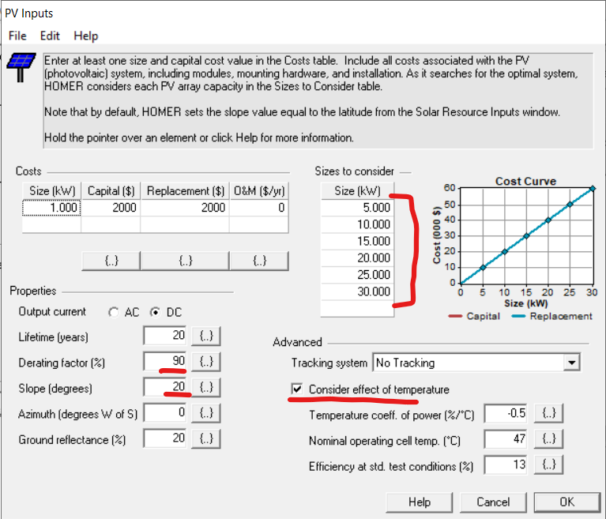
- For the battery: create a new battery, 10 V, 1000 Ah (10 kWh), with a flat capacity curve and 10% minimum SoC (roughly approximating Li-ion NMC in SAM in 10 kWh blocks), considering same sizes as SAM (2-10 batteries for 20-100 kWh). 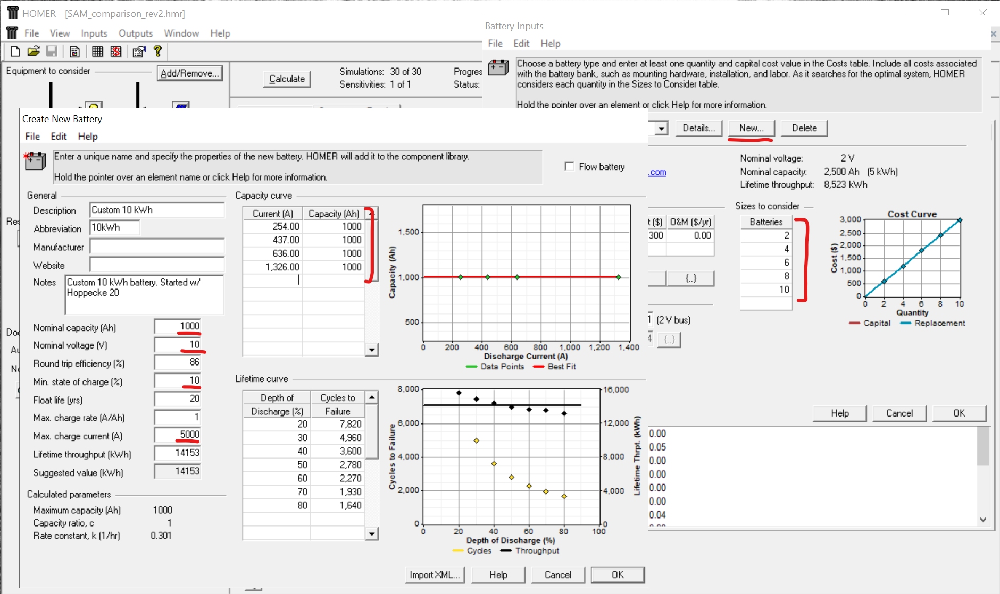
- For the converter: set the capacity to be greater than or equal to peak PV capacity, and charge and discharge efficiency to match SAM values (96%) 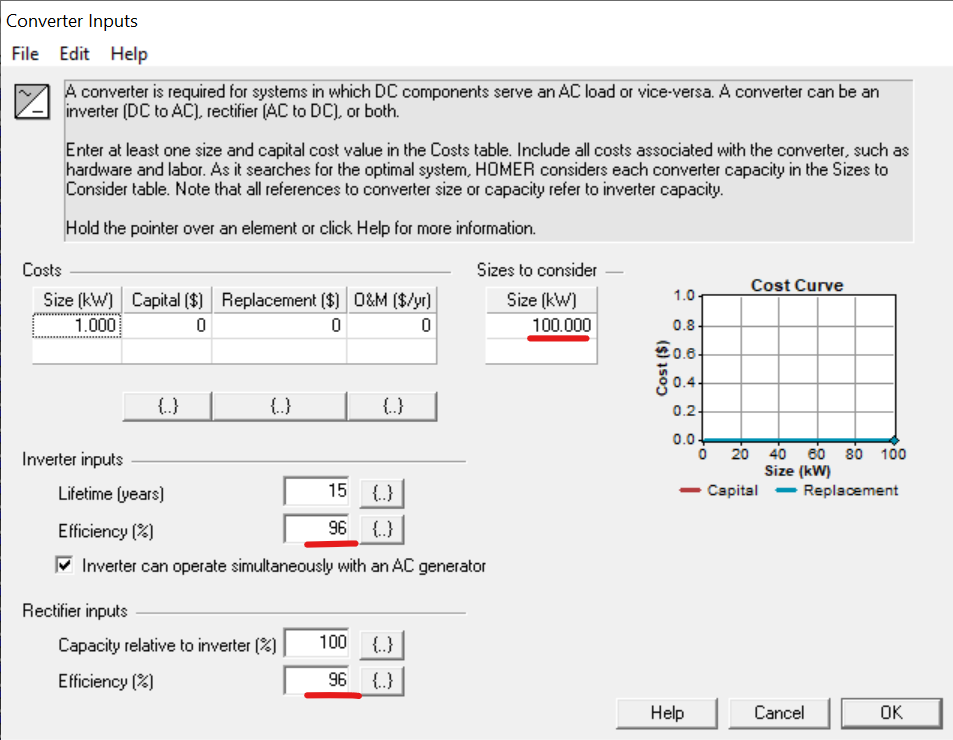
- Under Constraints, set the maximum annual capacity shortage to 100% 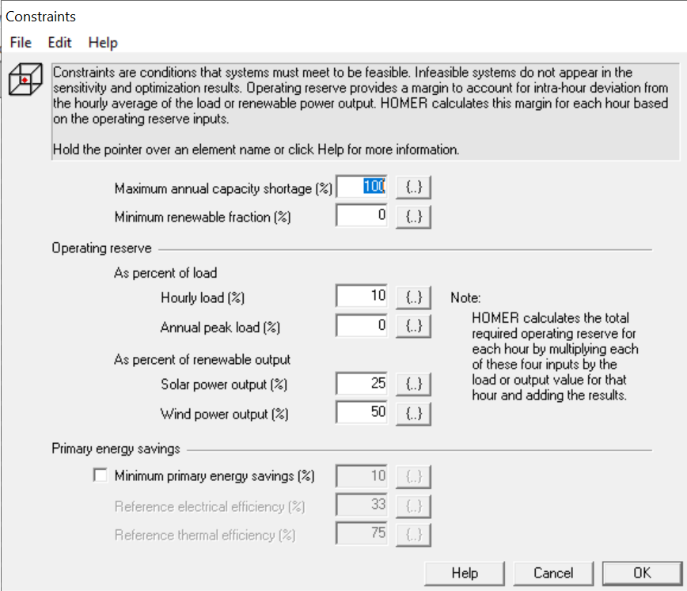
- Exporting results:
  - After hitting _Calculate_, view _Optimization Results_ > _Details..._, right click, and select _Export Table..._, then save the .CSV file. 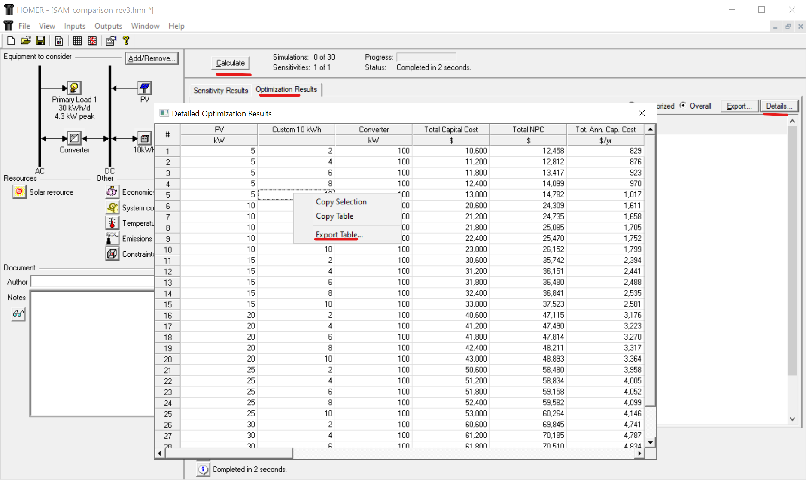
  - Use _Unmet Load_ (in kWh/yr) divided by annual load to calculate unmet load fraction.
